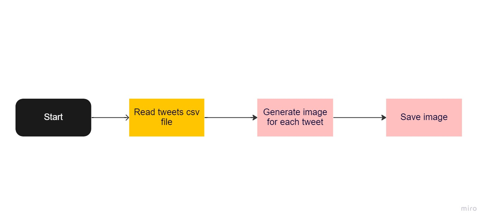

# Txt2image Runner

txt2image runner aims to automate the proccess of generating the dataset images from our sentiment analysis dataset.

## Architecture

## TODO
- Catch exception when directory already exists ( )
- Export to use environment variables ( )
- ZIP final folder ( )